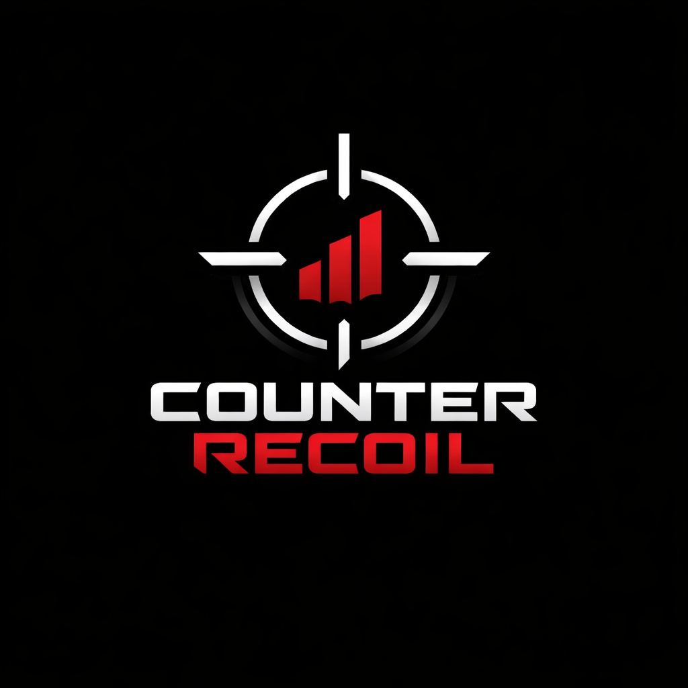

<p align="center">
  
</p>

# Counter Recoil

A simple AutoHotkey No Recoil for CS2 using configurable profiles and hotkeys.

> ⚠️ **Work in Progress**

This project is under active development. The core system is working, but a few UI features are still pending.

## What Works

### Supported profiles (working)
The following weapon profiles are currently integrated and working end-to-end:

- AK (`Ak`)
- M4A1-S (`M4a1s`)
- M4A4 (`M4a4`)
- Galil (`Galil`)
- Famas (`Famas`)

### Hotkeys (working)
Default weapon selection keys:

- `w1` → `Numpad1`
- `w2` → `Numpad2`
- `w3` → `Numpad3`
- `w4` → `Numpad4`
- `w5` → `Numpad5`
- `Off` → `Numpad0`

Controls:

- `PauseKey` → `XButton1` (toggle enabled/disabled)
- `shoot` → `LButton` (runs the selected profile while held)
- `ExitKey` → `End` (quit the app)

## Configuration

All settings are configurable via INI files.

### Sensitivity
Edit the `config/config.ini` file:

```ini
[Settings]
sens=1.80
zoomsens=1
```

* `sens`: your base sensitivity (used to compute the modifier)
* `zoomsens`: reserved for zoom scaling (currently stored and loaded)

### Weapon selection keybinds

Edit this section in `config/config.ini`:

```ini
[KeyBinds]
w1=Numpad1
w2=Numpad2
w3=Numpad3
w4=Numpad4
w5=Numpad5
Off=Numpad0
```

### Weapon name mapping

This maps a display name to a weapon slot (`w1..w5`). Edit `config/config.ini`:

```ini
[Profiles]
Ak=w1
M4a1s=w2
Famas=w3
M4a4=w4
Galil=w5
```

The active weapon label shown in the UI uses these names.

### Controls (mouse.ini)

Edit `config/mouse.ini`:

```ini
[Controls]
PauseKey=XButton1
shoot=LButton
ExitKey=End
```

## Disclaimer

This cheat is provided for educational purposes only. Use it at your own risk and do not use it in official game environments.
